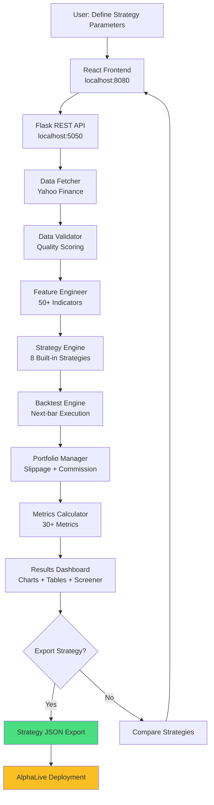

# AlphaLab

Desktop application for backtesting algorithmic trading strategies with production-grade execution simulation.

## Why AlphaLab?

Most backtesting tools either oversimplify execution (ignoring slippage, commissions, and position limits) or require expensive subscriptions. AlphaLab provides institutional-quality backtesting with realistic execution modeling, 30+ performance metrics, and Monte Carlo analysis - all running locally on your machine with free Yahoo Finance data.

## Architecture



## AlphaLab + AlphaLive: The Complete Trading System

AlphaLab is your **strategy development platform**. It works together with **AlphaLive** (separate repository) to provide a complete end-to-end algorithmic trading system.

### The Three Repositories

| Repo | Purpose | When to Run |
|------|---------|-------------|
| **[AlphaLab](https://github.com/bernardoguterres/AlphaLab)** (this repo) | Strategy development & backtesting | As needed (not 24/7) |
| **[AlphaLive](https://github.com/bernardoguterres/AlphaLive)** | Live trading execution | 24/7 during trading hours |
| **[AlphaSignal](https://github.com/bernardoguterres/AlphaSignal)** | Financial RAG - sentiment signals from SEC filings | Optional enrichment layer |
| **[DeepLOB](https://github.com/bernardoguterres/DeepLOB)** | CNN+LSTM LOB prediction - execution timing filter | Optional enrichment layer |

### How They Work Together

```
┌──────────────────────────────────────────────────────────────┐
│  AlphaLab (Development) - Run locally as needed              │
│                                                              │
│  1. Develop strategy logic                                  │
│  2. Backtest on 5 years of historical data                  │
│  3. Optimize parameters (walk-forward validation)           │
│  4. Export as JSON                                          │
└──────────────────────────────────────────────────────────────┘
                          ↓
                   strategy.json
                          ↓
┌──────────────────────────────────────────────────────────────┐
│  AlphaLive (Execution) - Run 24/7 on Railway or locally     │
│                                                              │
│  5. Load strategy JSON                                      │
│  6. Connect to Alpaca broker (paper or live)                │
│  7. Generate buy/sell signals in real-time                  │
│  8. Execute trades automatically                            │
│  9. Monitor positions (stop loss, take profit)              │
│  10. Send Telegram alerts                                   │
└──────────────────────────────────────────────────────────────┘
                          ↓
                  Live trading results
                          ↓
┌──────────────────────────────────────────────────────────────┐
│  Back to AlphaLab - Monthly re-backtesting                  │
│                                                              │
│  11. Compare live results vs backtest expectations          │
│  12. If performance degrades: re-optimize                   │
│  13. Export updated strategy → deploy to AlphaLive          │
└──────────────────────────────────────────────────────────────┘
                          │
                          └─────► (loop back to step 1)
```

### What You Need

**For strategy development** (this is AlphaLab):
- Run locally on your computer
- No cloud deployment needed
- Use when developing new strategies or re-backtesting

**For live trading** (requires AlphaLive):
- Clone [AlphaLive repository](https://github.com/bernardoguterres/AlphaLive)
- Deploy to Railway (~$5-20/month) or run locally 24/7
- Connect to Alpaca Markets (free paper trading account)
- Optional: Telegram bot for real-time trade alerts

### Export to AlphaLive

After backtesting a strategy in AlphaLab:

1. Click **"Export to AlphaLive"** button in the UI
2. Save the JSON file to AlphaLive's `configs/` directory
3. Deploy AlphaLive with the strategy JSON
4. Follow AlphaLive's deployment phases:
   - Week 1: Dry run (no orders, test signal generation)
   - Weeks 2-5: Paper trading (fake money, test execution)
   - Week 6+: Live trading (real money, start small)

**Important**: AlphaLab backtests show what *could have* happened. AlphaLive executes real trades. Always test thoroughly with paper trading before risking real money.

## Ecosystem

AlphaLab is the development platform in a three-repo algorithmic trading system:

| Repo | Role |
|------|------|
| **[AlphaLab](https://github.com/bernardoguterres/AlphaLab)** (this repo) | Backtest strategies, optimise parameters, export to AlphaLive |
| **[AlphaLive](https://github.com/bernardoguterres/AlphaLive)** | 24/7 execution engine - loads strategy JSON and trades automatically via Alpaca |
| **[AlphaSignal](https://github.com/bernardoguterres/AlphaSignal)** | Financial RAG layer - ingests SEC EDGAR filings and news, exposes sentiment signals via REST API |
| **[DeepLOB](https://github.com/bernardoguterres/DeepLOB)** | CNN+Inception+LSTM mid-price predictor - served as a REST endpoint, queried by AlphaLive as an execution timing filter |

**AlphaSignal as a signal source:** AlphaSignal's `/sentiment/{ticker}` endpoint returns sentiment scores derived from SEC 10-K/10-Q filings and financial news. These can be consumed as strategy features during backtesting in AlphaLab - for example, suppressing a buy signal when sentiment is strongly negative, or weighting position size by sentiment confidence. AlphaSignal runs as a separate service; AlphaLab queries it over HTTP and degrades gracefully if it's unavailable.

**DeepLOB as an execution timing filter:** DeepLOB predicts mid-price direction from limit order book snapshots using a CNN+Inception+LSTM architecture trained on the FI-2010 benchmark. AlphaLive queries it (alongside AlphaSignal) via a concurrent pre-execution gate before placing each order.

## Features

- **Market Data Pipeline** - Fetch, validate, and cache stock data from Yahoo Finance with automatic retry and quality scoring
- **50+ Technical Indicators** - SMA, EMA, MACD, RSI, Bollinger Bands, ATR, OBV, Fibonacci levels, and more
- **8 Built-in Strategies** - MA Crossover, RSI Mean Reversion, Momentum Breakout, Bollinger Breakout, VWAP Reversion, Bollinger RSI Combo, Trend Adaptive RSI, plus **GreenblattWeekly** (value factor, weekly bars via Greenblatt Magic Formula screening)
- **Fundamental Screener** - Greenblatt Magic Formula ranking (earnings yield + ROE) via free yfinance data, exportable candidate list for weekly strategy backtests
- **Realistic Backtesting** - Next-bar execution (no look-ahead bias), configurable slippage and commissions, position limits
- **30+ Performance Metrics** - Sharpe, Sortino, Calmar, max drawdown, VaR, win rate, profit factor, benchmark comparison
- **Monte Carlo Simulation** - Randomized entry timing to assess outcome distributions
- **Walk-Forward Validation** - Rolling train/test splits to detect overfitting
- **Comprehensive Backtesting Tools** - Batch runner, results visualization, strategy comparison across 5 years of data
- **REST API** - Flask endpoints with Pydantic validation for frontend integration

## Tech Stack

- **Backend**: Python, Flask, pandas, numpy, scipy, yfinance, stockstats, Pydantic, httpx, alpaca-py
- **Frontend**: React, TypeScript, Vite, shadcn/ui, Tailwind CSS, Recharts, Zustand
- **Desktop**: Tauri (Rust) - Native macOS/Windows/Linux app with <10MB footprint

## Quick Start

### Prerequisites
- Python 3.9+
- Node.js 18+ & npm

### Backend Setup

```bash
cd backend
python3 -m venv venv
source venv/bin/activate
pip install -r requirements.txt
python run.py
```

The API starts at `http://127.0.0.1:5050`.

### Frontend Setup

**Option 1: Web Version**
```bash
cd frontend
npm install
npm run dev
```
The UI starts at `http://localhost:8080`.

**Option 2: Desktop App (Tauri)**

Prerequisites (one-time):
```bash
# macOS only: Accept Xcode license (if not already done)
sudo xcodebuild -license

# Install Rust (all platforms)
curl --proto '=https' --tlsv1.2 -sSf https://sh.rustup.rs | sh
source $HOME/.cargo/env
```

Run:
```bash
cd frontend
npm install                 # First time only
npm run tauri:dev          # Launch desktop app (first run: 2-3 min)
npm run tauri:build        # Build installer (.dmg/.msi/.deb)
```

**Installing the .dmg (macOS):**
After running `npm run tauri:build`, find the installer at:
```
frontend/src-tauri/target/release/bundle/dmg/AlphaLab_*.dmg
```
Double-click to install, then drag AlphaLab.app to your Applications folder.

### Full Application

Run backend + frontend in separate terminals:

```bash
# Terminal 1 - Backend (REQUIRED for both web and desktop)
cd backend && source venv/bin/activate && python run.py

# Terminal 2 - Frontend (choose one):
cd frontend && npm run dev           # Web → http://localhost:8080
# OR
cd frontend && npm run tauri:dev     # Desktop → native app window
```

### Run Tests

```bash
# Backend tests (293 tests: 290 passing, 3 skipped), 91% coverage
cd backend
source venv/bin/activate
pytest tests/ -v

# Frontend tests
cd frontend
npm run test
```

## API Endpoints

| Method | Endpoint | Description |
|--------|----------|-------------|
| GET | `/api/health` | Health check |
| POST | `/api/data/fetch` | Fetch and cache stock data |
| GET | `/api/data/available` | List cached tickers |
| POST | `/api/strategies/backtest` | Run a backtest |
| POST | `/api/strategies/optimize` | Grid search for best parameters |
| GET | `/api/metrics/<id>` | Retrieve backtest results |
| POST | `/api/compare` | Compare multiple strategies |
| POST | `/api/screener/greenblatt` | Greenblatt Magic Formula screen (pass `{"tickers":[...], "top_n":20}`) |

For full API documentation, see the [Flask routes source code](backend/src/api/routes.py).

### Example: Run a Backtest

```bash
curl -X POST http://127.0.0.1:5050/api/strategies/backtest \
  -H "Content-Type: application/json" \
  -d '{
    "ticker": "AAPL",
    "strategy": "ma_crossover",
    "start_date": "2020-01-01",
    "end_date": "2024-12-31",
    "initial_capital": 100000
  }'
```

## Available Strategies

### 1. Moving Average Crossover (`ma_crossover`)
**Trend-following strategy.** Buy when a short-period MA crosses above a long-period MA (Golden Cross), sell on reverse (Death Cross). Best for trending markets with sustained directional moves. Works well on daily/weekly timeframes. **Avg return: +13.8%** (21/30 stocks tested, 2020-2024).

**Key params:** `short_window` (default 50), `long_window` (default 200), `volume_confirmation`, `cooldown_days`

---

### 2. RSI Mean Reversion (`rsi_mean_reversion`)
**State-aware mean reversion.** Buy when RSI drops below oversold threshold, sell when above overbought threshold. Uses Bollinger Band confirmation and optional ADX trend filter. Includes stop-loss (2.5×ATR) and max 40-day hold. **Avg return: +3.2%**, best for capital preservation in choppy markets.

**Key params:** `rsi_period` (14), `oversold` (30), `overbought` (70), `use_bb_confirmation`, `use_adx_filter`

---

### 3. Momentum Breakout (`momentum_breakout`)
**Breakout strategy with risk management.** Buy when price breaks above N-day high with volume surge (>150% avg) + RSI confirmation. Sell on N-day low. Uses trailing stops (3×ATR). **Avg return: +7.6%** (18/21 profitable). Most active strategy.

**Key params:** `lookback` (20), `volume_surge_pct` (150), `rsi_min` (50), `stop_loss_atr_mult`

---

### 4. Bollinger Band Breakout (`bollinger_breakout`)
**Volatility breakout with confirmation.** Buy when price closes above upper BB for N consecutive bars, sell on lower BB breach. Exits at middle band (SMA). Optional volume filter (1.5× 20-day avg). Best for volatile stocks breaking consolidation.

**Key params:** `bb_period` (20), `bb_std_dev` (2.0), `confirmation_bars` (2), `volume_filter`

---

### 5. VWAP Mean Reversion (`vwap_reversion`)
**Volume-weighted mean reversion.** Buy when price deviates below VWAP by N std devs + RSI oversold. Sell when above VWAP + RSI overbought. Exit at VWAP. Best for liquid stocks with strong volume patterns. Uses rolling VWAP based on typical price × volume.

**Key params:** `vwap_period` (20), `deviation_threshold` (2.0), `oversold` (30), `overbought` (70)

---

### 6. Bollinger RSI Combo (`bollinger_rsi_combo`)
**Dual confirmation mean reversion.** Entry requires BOTH price ≤ BB lower band AND RSI < oversold threshold (default 45). Exit when price ≥ BB middle band OR RSI > overbought threshold (default 55). More selective than pure RSI - catches bounces off dynamic support with momentum confirmation.

**Key params:** `bb_period` (20), `bb_std` (2.0), `rsi_period` (14), `rsi_oversold` (45), `rsi_overbought` (55), `exit_at_middle` (true)

**Recommended timeframe:** 15Min for intraday (1-3 signals/day), Daily for swing trading

---

### 7. Trend Adaptive RSI (`trend_adaptive_rsi`)
**Market regime-aware RSI.** Detects trend using SMA(50) slope and adjusts entry/exit thresholds accordingly:
- **Uptrend** (price > SMA, SMA rising): Buy RSI 45, Sell 65 - buys dips rather than waiting for extreme oversold
- **Downtrend** (price < SMA, SMA falling): Buy RSI 35, Sell 55 - fades bounces
- **Range**: Buy RSI 35, Sell 65 - standard mean reversion

Trades in all market conditions instead of going quiet during trends.

**Key params:** `rsi_period` (14), `trend_sma` (50), `trend_lookback` (5), `uptrend_buy` (45), `uptrend_sell` (65), `downtrend_buy` (35), `downtrend_sell` (55), `range_buy` (35), `range_sell` (65)

**Recommended timeframe:** 1Hour for regime stability, Daily for longer-term trends

---

### 8. Greenblatt Weekly (`greenblatt_weekly`) - value factor, weekly bars

**Designed for ~1 year holding periods.** Use after running the Greenblatt screener (`POST /api/screener/greenblatt`) to identify quality candidates. Entry timing on weekly bars only.

**Entry** (either condition):
- Weekly RSI < 35 (oversold on weekly timeframe = much stronger signal than daily)
- 10-week SMA crosses above 50-week SMA (weekly golden cross)

**Exit:**
- **Default (always active):** Price drops 20% below position peak - trailing stop fires immediately, bypasses minimum hold
- **Opt-in (disabled by default):** Weekly RSI > 65, or 10w/50w SMA death-cross - only fires after minimum hold elapsed

**Key params:** `fast_sma` (10w), `slow_sma` (50w), `rsi_oversold` (35), `rsi_overbought` (65), `min_hold_bars` (52 weeks), `trailing_stop_pct` (0.20)

**Recommended timeframe:** `1wk` (weekly bars via yfinance interval parameter)

**Workflow:**
1. Run `POST /api/screener/greenblatt` with your target universe
2. Take top 15–20 candidates by combined rank
3. Batch backtest with `strategy=greenblatt_weekly`, `interval=1wk`
4. Export candidates with walk-forward Sharpe > 0.8 → AlphaLive

## Project Structure

```
AlphaLab/
├── backend/                    # Flask REST API (Python)
│   ├── src/
│   │   ├── data/              # Fetching, validation, feature engineering
│   │   ├── strategies/        # BaseStrategy + 6 implementations
│   │   ├── backtest/          # Engine, portfolio, metrics, orders
│   │   ├── api/               # Flask routes + Pydantic validators
│   │   └── utils/             # Logger, config, exceptions
│   ├── tests/                 # 81 pytest tests
│   ├── config.yaml
│   ├── requirements.txt
│   ├── run.py
│   ├── backtest_runner.py     # Batch backtest tool (tests all strategies)
│   └── backtest_results.json  # 5-year backtest results (12 strategy-ticker combos)
├── frontend/                   # React UI (TypeScript + Vite + Tauri)
│   ├── src/
│   │   ├── pages/             # Dashboard, Backtest, Compare, DataManager
│   │   ├── components/        # UI components (charts, forms, metrics)
│   │   ├── services/          # API client (axios)
│   │   ├── stores/            # Zustand state management
│   │   ├── types/             # TypeScript types
│   │   └── utils/             # Formatters, validators
│   ├── src-tauri/             # Tauri desktop app config
│   ├── package.json
│   ├── vite.config.ts
│   └── tailwind.config.ts
├── docs/                       # Technical documentation
│   ├── API.md
│   ├── ARCHITECTURE.md
│   ├── STRATEGIES.md
│   ├── METRICS_GUIDE.md
│   └── TROUBLESHOOTING.md
├── README.md                   # This file
├── SETUP.md                    # Setup instructions
├── TAURI_SETUP.md              # Desktop app rebuild guide
├── CONTRIBUTING.md             # Contribution guidelines
├── CLAUDE.md                   # Development guide
├── LICENSE
└── .gitignore
```

## Documentation

**Getting Started:**
- [SETUP.md](SETUP.md) - Installation and setup instructions
- [Metrics Guide](docs/METRICS_GUIDE.md) - What each metric means (Sharpe, Sortino, drawdown, etc.)
- [Strategy Export Schema](docs/STRATEGY_SCHEMA.md) - JSON schema for AlphaLive integration

**For Contributors:**
- [CONTRIBUTING.md](CONTRIBUTING.md) - How to contribute to the project
- [CLAUDE.md](CLAUDE.md) - Development guide for AI assistants (not in public repo)

## Configuration

All settings are in `backend/config.yaml` - initial capital, slippage, commission rates, strategy defaults, API port, and logging.

## Roadmap

- [x] React + TypeScript frontend with interactive charts (Recharts)
- [x] Dashboard with backtest history and quick stats
- [x] Strategy comparison page (side-by-side analysis)
- [x] Tauri desktop packaging (.dmg for macOS, .msi for Windows, .deb for Linux)
- [x] Bollinger Band Breakout and VWAP Reversion strategies
- [x] Portfolio optimization (Max Sharpe, Min Variance, Risk Parity, Equal Weight)
- [x] Batch backtesting (test one strategy across multiple tickers)
- [x] Strategy export to JSON (AlphaLive integration)
- [ ] Additional strategies (Pairs Trading, Statistical Arbitrage)
- [ ] PDF report export
- [ ] Real-time data via WebSocket
- [ ] Machine learning strategy framework

---

## Contributing

We welcome contributions! Here's how to get started:

### Development Workflow

1. **Fork the repository**
2. **Clone your fork:**
   ```bash
   git clone https://github.com/YOUR_USERNAME/alphalab.git
   cd alphalab
   ```
3. **Set up the development environment:**
   - Follow [SETUP.md](SETUP.md) for backend and frontend setup

### Backend Development

```bash
cd backend
source venv/bin/activate
python run.py
```

**Making changes:**
1. Create a new branch: `git checkout -b feature/your-feature-name`
2. Make your changes
3. Run tests: `pytest tests/ -v`
4. Ensure all 290 tests pass

**Code style:**
- Follow PEP 8
- Use Black formatter (100-char lines)
- Add Google-style docstrings to public methods
- Type hints where appropriate

### Frontend Development

```bash
cd frontend
npm run dev          # Web version
npm run tauri:dev    # Desktop version
```

**Making changes:**
1. Create a new branch: `git checkout -b feature/your-feature-name`
2. Make your changes
3. Run linter: `npm run lint`
4. Run tests: `npm run test`
5. Test in both web and desktop modes

**Code style:**
- TypeScript strict mode
- ESLint + Prettier
- Use functional components and hooks
- Tailwind for styling (no inline styles)

### Adding a New Strategy

1. **Create strategy file:**
   ```
   backend/src/strategies/implementations/your_strategy.py
   ```

2. **Inherit from BaseStrategy:**
   ```python
   from ..base_strategy import BaseStrategy

   class YourStrategy(BaseStrategy):
       def validate_params(self, params: dict) -> dict:
           # Validate parameters
           pass

       def generate_signals(self, data: pd.DataFrame, params: dict) -> pd.DataFrame:
           # Generate buy/sell signals
           pass

       def required_columns(self) -> list:
           # Return required indicator columns
           pass
   ```

3. **Register in `implementations/__init__.py`**
4. **Add to `STRATEGY_MAP` in `api/routes.py`**
5. **Add tests in `tests/test_strategies.py`**
6. **Document in `docs/STRATEGIES.md`**

### Pull Request Process

1. **Update documentation** - Update relevant markdown files
2. **Add tests** - New features need test coverage
3. **Run all tests** - Ensure nothing breaks
4. **Commit with clear messages:**
   ```
   feat: Add Bollinger Band breakout strategy
   fix: Correct slippage calculation in portfolio
   docs: Update API documentation for new endpoint
   ```

5. **Push to your fork:**
   ```bash
   git push origin feature/your-feature-name
   ```

6. **Create Pull Request** - Provide clear description of changes

### Commit Message Guidelines

We follow conventional commits:

- `feat:` New feature
- `fix:` Bug fix
- `docs:` Documentation changes
- `test:` Adding or updating tests
- `refactor:` Code refactoring
- `perf:` Performance improvements
- `chore:` Maintenance tasks

**Examples:**
```
feat: Add walk-forward validation to backtest engine
fix: Handle missing data in RSI calculation
docs: Add examples to METRICS_GUIDE.md
test: Add unit tests for DataValidator
```

### Code Review Checklist

Before submitting, ensure:

- [ ] Code follows project style guidelines
- [ ] All tests pass
- [ ] New tests added for new features
- [ ] Documentation updated
- [ ] No sensitive data (API keys, credentials)
- [ ] Changes work in both web and desktop modes (if frontend)
- [ ] Performance impact considered (if applicable)

### Reporting Issues

**Bug reports should include:**
- Clear description of the issue
- Steps to reproduce
- Expected vs actual behavior
- Environment (OS, Python/Node version)
- Relevant logs or error messages

**Feature requests should include:**
- Use case / motivation
- Proposed solution
- Any alternatives considered

---

## Project Status

**Current Version:** 0.1.0
**Status:** Production Ready

### What's Included

#### Backend
- Flask REST API (127.0.0.1:5050)
- 293 tests (290 passing, 3 skipped), 91% coverage
- 14 API endpoints with Pydantic validation
- 8 trading strategies (MA Crossover, RSI Mean Reversion, Momentum Breakout, Bollinger Breakout, VWAP Reversion, Bollinger RSI Combo, Trend Adaptive RSI, GreenblattWeekly)
- 50+ technical indicators
- 30+ performance metrics
- Data caching with parquet
- Python virtual environment configured

#### Frontend
- React + TypeScript + Vite
- 6 pages: Dashboard, Backtest (Single + Batch), Compare, DataManager, Portfolio, Settings
- shadcn/ui components
- Recharts visualizations (equity curves, drawdowns, monthly returns heatmap)
- Zustand state management
- React Query for API calls
- Tailwind CSS styling

#### Desktop App (Tauri)
- Tauri configured and working
- macOS .dmg installer (5.5MB)
- Correct app icons installed (1024x1024 source)
- App ID: com.alphalab.app
- Window: 1400x900 (min 1200x700)
- Build scripts: `tauri:dev`, `tauri:build`

### Project Stats

- **Backend Code:** Python, Flask
- **Frontend Code:** TypeScript, React
- **Total Tests:** 293 (290 passing, 3 skipped), 91% coverage
- **API Endpoints:** 14
- **Strategies:** 8
- **Indicators:** 50+
- **Metrics:** 30+
- **Desktop Installer:** 5.5MB

---

## Troubleshooting

### Backend won't start: "ModuleNotFoundError: No module named 'src'"
**Solution:** You're running from the wrong directory or virtualenv isn't activated.
```bash
cd backend
source venv/bin/activate
python run.py
```

### yfinance download fails or returns empty data
**Causes:**
- Invalid ticker symbol (check it exists on Yahoo Finance)
- Network connectivity issue
- Rate limit hit (~2000 requests/hour max)
- Date range too old (before stock's IPO)

**Solution:** DataFetcher retries 3 times automatically. If still failing, verify the ticker manually at `finance.yahoo.com`.

### Feature engineering produces all NaN values
**Cause:** Not enough data for indicator lookback periods. A 200-day SMA needs 200+ data points.

**Solution:** Fetch at least 1 year of daily data (252+ rows). For all indicators to be populated, fetch 2+ years.

### Backtest returns 0 trades
**Possible causes:**
- Insufficient capital for position sizing
- Data doesn't meet strategy requirements (missing indicators)
- Date range too short for strategy parameters (e.g., 50/200 SMA crossover needs 200+ days)

**Debug:** Check `backend/logs/alphalab.log` for rejected orders or missing columns.

### Data quality score too low (< 0.9)
**Cause:** DataValidator detected issues:
- Many missing trading days (stock halted/delisted)
- Extreme price movements flagged as outliers (could be legitimate for biotech/penny stocks)
- Corrupt data from Yahoo Finance

**Solution:** Try a different date range or check if the stock had unusual events (splits, halts) during that period.

---

## FAQ

**Q: Can I use this for real trading?**
A: AlphaLab is designed for backtesting and research. For live trading, use **AlphaLive** (separate repository) which connects to Alpaca Markets and handles real-time execution. Always start with paper trading before risking real money.

**Q: Why is TA-Lib not used?**
A: The Python `ta-lib` package requires a system-level C library that's difficult to install on some platforms. AlphaLab uses manual implementations and `stockstats` instead, which produce equivalent results for the indicators implemented.

**Q: Can I add crypto/forex data?**
A: yfinance supports some crypto (e.g., `BTC-USD`) and forex pairs. The system hasn't been tested extensively with these, but the data pipeline should work. Feature engineering may need adjustment for 24/7 markets.

**Q: How do I add a custom strategy?**
A: See "Adding a New Strategy" section above. Create a file in `backend/src/strategies/implementations/`, inherit from `BaseStrategy`, implement the required methods, and register it in the API.

**Q: Why does my strategy show negative Sharpe ratio?**
A: Negative Sharpe means the strategy lost money on a risk-adjusted basis (returns below risk-free rate). This isn't a bug - it means the strategy isn't profitable. Try different parameters, a different stock, or a different strategy.

**Q: How accurate are the backtest results?**
A: AlphaLab uses next-bar execution (no look-ahead bias), realistic slippage (0.05%), and configurable commissions to model real-world conditions. However, backtests can't predict future market conditions. Always validate strategies with walk-forward testing and paper trading before going live.

---

## License

MIT - see [LICENSE](LICENSE)
