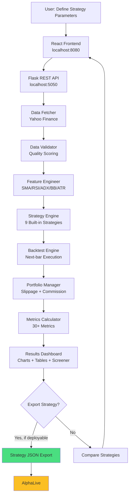

# AlphaLab

AlphaLab is the research and validation component of the **Alpha** algorithmic-trading
ecosystem. It handles historical market-data processing, technical indicators, strategy
backtesting with realistic execution costs, walk-forward validation, performance analysis, and
export of compatible strategy configurations to **AlphaLive** for execution. A React frontend
sits on top of a Flask REST API.

**Status: Portfolio release / validated engineering prototype.** The backtest engine, cost
modelling, and walk-forward machinery are implemented and tested against real historical data.
This is not a claim of discovered trading alpha - see [Results](#results) below.

## Why AlphaLab?

Many backtesting tools oversimplify execution (ignoring slippage, commissions, position limits)
or gate realistic modelling behind paid subscriptions. AlphaLab implements next-bar execution,
configurable slippage/commissions, position limits, and 30+ performance metrics using free
Yahoo Finance data - built to test *whether* a strategy idea holds up, not to assert that any
particular strategy is profitable.

## Architecture


```mermaid
flowchart TD
    A[User: Define Strategy Parameters] --> B[React Frontend<br/>localhost:8080]
    B --> C[Flask REST API<br/>localhost:5050]
    C --> D[Data Fetcher<br/>Yahoo Finance]
    D --> E[Data Validator<br/>Quality Scoring]
    E --> F[Feature Engineer<br/>SMA/RSI/ADX/BB/ATR]
    F --> G[Strategy Engine<br/>9 Built-in Strategies]
    G --> H[Backtest Engine<br/>Next-bar Execution]
    H --> I[Portfolio Manager<br/>Slippage + Commission]
    I --> J[Metrics Calculator<br/>30+ Metrics]
    J --> K[Results Dashboard<br/>Charts + Tables + Screener]
    K --> L{Export Strategy?}
    L -->|Yes, if deployable| M[Strategy JSON Export]
    M --> N[AlphaLive]
    L -->|No| O[Compare Strategies]
    O --> B

    style M fill:#4ade80
    style N fill:#fbbf24
```

## The Alpha Ecosystem

AlphaLab is the research component of a three-repository system:

| Repo | Role |
|------|------|
| **AlphaLab** (this repo) | Research: historical backtesting, walk-forward validation, strategy comparison, export |
| **AlphaLive** | Execution: loads a compatible strategy export, generates signals, applies risk controls, can connect to Alpaca's paper/live-capable API |
| **AlphaSignal** | Financial RAG/sentiment service consumed by AlphaLive as an optional pre-execution gate |

AlphaLab does **not** call AlphaSignal directly - that integration lives entirely in AlphaLive.

### How a strategy moves through the ecosystem

```
AlphaLab: develop → backtest on historical data → walk-forward validate → export JSON
                                    ↓
                         AlphaLive: import → generate signals → risk controls
                                    ↓                → optional AlphaSignal gate
                                    ↓                → Alpaca paper/live-capable API
```

Exported strategy configurations were validated to load into AlphaLive without hand-editing,
and cross-system signal-generation parity between the two engines was measured on multi-year
historical data - see [Cross-System Parity](#cross-system-parity-with-alphalive) below for the
exact figures. This is a meaningfully stronger claim than "the two repos share a JSON schema" -
it means the same historical bars, fed to both engines independently, were shown to produce
matching trading decisions in the overwhelming majority of cases, with the residual small
differences root-caused and documented rather than hidden.

**Not every backtestable strategy is deployable to AlphaLive.** `rsi_simple` is a research/testing
strategy only - `POST /api/strategies/export` rejects it explicitly with a clear message rather
than producing a config AlphaLive would only reject later. `vwap_reversion` is similarly
backtestable but export-blocked, because it requires an intraday timeframe AlphaLab's data layer
cannot fetch. Both remain fully usable for backtesting and research; neither is exportable.

## Results

The strategies implemented here are established, textbook systematic approaches (moving-average
crossovers, RSI mean reversion, Bollinger Band breakouts, and similar) rather than novel alpha
models. Walk-forward, out-of-sample validation was run on real historical data for the daily
technical strategies, and the tested strategies did **not** consistently outperform their passive
benchmarks - out-of-sample Sharpe ratios were zero or negative in most tested windows. This result
was retained rather than tuned away by re-running the grid or changing the test period after
seeing it.

That is the intended value of walk-forward validation: it is designed to reject strategies that
only look good in-sample, and a well-built research pipeline should be expected to reject most
naive textbook strategies rather than validate all of them. The point of AlphaLab is the
infrastructure for researching, testing, and rejecting strategies on their genuine merits - not
a claim that the specific strategies shipped here have discovered persistent market alpha. No
such claim is made.

The Greenblatt Magic Formula screener/weekly strategy is not included in this conclusion as clean
evidence either way: `FundamentalScreener` applies *today's* fundamentals to *historical* prices
(no point-in-time data source exists for it), and its default universe is a hand-picked,
present-day list of large caps (survivorship exposure). Any historical return figure for this
strategy reflects both of those biases and should not be read as a validated result. See
`CLAUDE.md`'s "Greenblatt ranking-vs-diversification correction" section for the full accounting,
including a widened-universe re-test where the ranking loses to plain diversification in 4 of 6
tested windows.

## Cross-System Parity with AlphaLive

End-to-end validation compared AlphaLab's and AlphaLive's trading decisions bar-by-bar on
multi-year real historical AAPL data, feeding both engines identical bars and parameters. This
process found and fixed genuine defects: AlphaLive was silently ignoring several `ma_crossover`
parameters (volume confirmation, minimum MA separation, cooldown), and the two repos computed RSI
with two different, disagreeing formulas while AlphaLab's own `rsi_period` parameter had no effect
on its own calculation at all. Both were repaired, with a canonical RSI implementation adopted
independently in both repos and verified bit-identical on shared golden-value tests.

Final measured parity, after those fixes:

| Strategy | Parity | Detail |
|---|---|---|
| `ma_crossover` | 99.92% (1256/1257 bars) | 1 residual, isolated, non-cascading mismatch |
| `rsi_mean_reversion`, default period | 99.76% (1254/1257 bars) | up from 87.59% before the fix |
| `rsi_mean_reversion`, non-default period (9) | 99.52% (1251/1257 bars) | proves `rsi_period` genuinely affects both research and execution |

Cross-system strategy parity was validated on multi-year historical data, with small remaining
numerical differences documented, not eliminated to zero. The residual `rsi_mean_reversion` gaps
are root-caused to a numerical difference between the two repos' ATR implementations (used by the
strategy's stop-loss), not to RSI itself. Do not read this as "AlphaLive replicates AlphaLab
exactly" - it does not, quite, and the exact remaining gap is documented rather than rounded away.

## Features

- **Market Data Pipeline** - fetch, validate, and cache stock data from Yahoo Finance with retry and quality scoring
- **Technical Indicators** - SMA (10/20/50/100/200), RSI, ADX (+DI lines), Bollinger Bands, ATR
- **9 Built-in Strategies** - see [Available Strategies](#available-strategies) below; not all are AlphaLive-deployable
- **Fundamental Screener** - Greenblatt Magic Formula ranking (earnings yield + ROC) via yfinance, with the point-in-time limitation noted above
- **Realistic Backtesting** - next-bar execution (verified, not just designed, against real data - see below), configurable slippage/commissions, position limits, configurable `max_drawdown_pct` halt
- **30+ Performance Metrics** - Sharpe, Sortino, Calmar, max drawdown, VaR, win rate, profit factor, benchmark comparison
- **Walk-Forward Validation** - rolling train/test splits with genuinely train-only parameter selection (verified from code and from window-by-window output, not just claimed)
- **Monte Carlo Simulation** - randomized entry timing to assess outcome distributions
- **Strategy Export** - JSON export compatible with AlphaLive's import, for deployable strategies

### No-look-ahead-bias verification

Next-bar execution is enforced architecturally (a signal generated at bar N's close is only
executed at bar N+1's open) and was additionally verified at runtime: signals were generated on
data truncated at a fixed timestamp, then again after appending future bars, and the historical
signal at that timestamp was confirmed unchanged. This is one targeted test, not a proof that no
leakage exists anywhere in the codebase, but it is real runtime evidence rather than a design
claim alone.

## Tech Stack

- **Backend**: Python, Flask, pandas, numpy, scipy, yfinance, Pydantic, httpx
- **Frontend**: React, TypeScript, Vite, shadcn/ui, Tailwind CSS, Recharts, Zustand
- **Deployment**: Railway-ready (backend via Docker + gunicorn, frontend via Docker + nginx static serve) - not currently deployed; see [Deployment](#deployment)

## Quick Start

### Prerequisites
- Python 3.9+
- Node.js 18+ & npm

### Backend Setup

```bash
cd backend
python3 -m venv venv
source venv/bin/activate
pip install -r requirements.txt
python run.py
```

The API starts at `http://127.0.0.1:5050`.

### Frontend Setup

```bash
cd frontend
npm install
npm run dev
```

The UI starts at `http://localhost:8080`.

### Run Both

```bash
# Terminal 1
cd backend && source venv/bin/activate && python run.py

# Terminal 2
cd frontend && npm run dev
```

### Run Tests

```bash
# Backend: 423 tests, black-formatted
cd backend
source venv/bin/activate
pytest tests/ -v

# Frontend: 42 tests
cd frontend
npm run test
```

### Run a Representative Backtest

```bash
curl -X POST http://127.0.0.1:5050/api/strategies/backtest \
  -H "Content-Type: application/json" \
  -d '{
    "ticker": "AAPL",
    "strategy": "rsi_mean_reversion",
    "start_date": "2020-01-01",
    "end_date": "2024-12-31",
    "initial_capital": 100000,
    "params": {"rsi_period": 14, "oversold": 30, "overbought": 70}
  }'
```

### Run Walk-Forward Validation

```bash
curl -X POST http://127.0.0.1:5050/api/strategies/optimize \
  -H "Content-Type: application/json" \
  -d '{
    "ticker": "AAPL",
    "strategy": "rsi_mean_reversion",
    "start_date": "2020-01-01",
    "end_date": "2024-12-31",
    "param_grid": {"rsi_period": [9, 14, 20], "oversold": [25, 30]},
    "walk_forward": true,
    "n_folds": 3
  }'
```

Parameters are selected using only each fold's training data and scored once, out-of-sample, on
that fold's held-out test window - genuinely train-only selection, not selection followed by
testing on the same data.

### Export a Deployable Strategy

Run a backtest (above), note the returned `backtest_id`, then:

```bash
curl -X POST http://127.0.0.1:5050/api/strategies/export \
  -H "Content-Type: application/json" \
  -d '{"backtest_id": "<backtest_id from above>"}'
```

This produces a JSON file AlphaLive's config loader accepts without modification. `rsi_simple`
and `vwap_reversion` return a `422` with an explanation instead of an export - see
[The Alpha Ecosystem](#the-alpha-ecosystem) above.

## API Endpoints

| Method | Endpoint | Description |
|--------|----------|-------------|
| GET | `/api/health` | Health check |
| POST | `/api/data/fetch` | Fetch and cache stock data |
| GET | `/api/data/available` | List cached tickers |
| POST | `/api/strategies/backtest` | Run a backtest |
| POST | `/api/strategies/optimize` | Grid search / walk-forward validation |
| GET | `/api/metrics/<id>` | Retrieve backtest results |
| POST | `/api/compare` | Compare multiple strategies |
| POST | `/api/strategies/export` | Export a strategy for AlphaLive |
| POST | `/api/screener/greenblatt` | Greenblatt Magic Formula screen (`{"tickers":[...], "top_n":20}`) |

For the full endpoint list see `backend/alphalab/api/blueprints/`.

## Available Strategies

Nine strategies are implemented and backtestable. Eight are AlphaLive-deployable; `rsi_simple` is
research-only (see above). Parameter defaults below are AlphaLab's own; AlphaLive may apply its
own defaults for fields an export omits.

| # | Strategy | Type | Key params | Deployable |
|---|---|---|---|---|
| 1 | `ma_crossover` | Trend-following | `short_window` (50), `long_window` (200), `volume_confirmation`, `cooldown_days` | Yes |
| 2 | `rsi_mean_reversion` | Mean reversion, stateful (stop-loss, cooldown, BB/ADX confirmation) | `rsi_period` (14), `oversold` (30), `overbought` (70) | Yes |
| 3 | `momentum_breakout` | Breakout | `lookback` (20), `volume_surge_pct` (150), `rsi_min` (50) | Yes |
| 4 | `bollinger_breakout` | Volatility breakout | `bb_period` (20), `bb_std_dev` (2.0), `confirmation_bars` (2) | Yes |
| 5 | `vwap_reversion` | VWAP mean reversion | `vwap_period` (20), `deviation_threshold` (2.0) | **No** - requires an intraday timeframe AlphaLab can't fetch |
| 6 | `bollinger_rsi_combo` | Dual-confirmation mean reversion | `bb_period` (20), `rsi_oversold` (45), `rsi_overbought` (55) | Yes |
| 7 | `trend_adaptive_rsi` | Regime-adaptive RSI | `trend_sma` (50), separate up/down/range thresholds | Yes |
| 8 | `greenblatt_weekly` | Value factor, weekly bars | `fast_sma` (10w), `slow_sma` (50w), `min_hold_bars` (52w), `trailing_stop_pct` (0.20) | Yes - see [Results](#results) for the point-in-time caveat |
| 9 | `rsi_simple` | Simple RSI mean reversion, no state machine | `rsi_period` (14), `oversold` (40), `overbought` (60) | **No** - research-only |

### Greenblatt weekly workflow

1. `POST /api/screener/greenblatt` with a candidate universe
2. Take the top-ranked candidates by combined rank
3. Batch backtest with `strategy=greenblatt_weekly`, `interval=1wk`, `max_drawdown_pct=40` (the
   engine's 10% default halts weekly strategies too early - see CLAUDE.md)
4. Read the results with the point-in-time-fundamentals caveat above in mind before exporting

## Project Structure

```
AlphaLab/
├── backend/                    # Flask REST API (Python)
│   ├── alphalab/
│   │   ├── data/               # Fetching, validation, feature engineering
│   │   ├── strategies/         # BaseStrategy + 9 implementations
│   │   ├── backtest/           # Engine, portfolio, metrics, walk-forward optimizer
│   │   ├── api/                # Flask blueprints + Pydantic validators
│   │   └── utils/              # Logger, config, exceptions
│   ├── tests/                  # 423 tests
│   ├── config.yaml
│   ├── requirements.txt
│   ├── run.py                  # Local dev entry point
│   ├── wsgi.py                 # Production entry point (gunicorn)
│   └── Dockerfile
├── scripts/                    # Standalone research tools (run outside the API)
│   ├── walk_forward_validation.py   # Walk-forward validation for daily strategies
│   ├── greenblatt_walk_forward.py   # Walk-forward validation for GreenblattWeekly
│   ├── greenblatt_research.py       # Greenblatt/diversification research tool
│   ├── sector_rotation_research.py  # Sector-rotation research tool
│   └── wf_common.py                 # Shared helpers
├── frontend/                   # React UI (TypeScript + Vite)
│   ├── src/
│   │   ├── pages/               # Dashboard, Backtest, Compare, DataManager, Settings
│   │   ├── components/          # UI components (charts, forms, metrics)
│   │   ├── services/            # API client (axios)
│   │   ├── stores/               # Zustand state management
│   │   ├── types/                # TypeScript types
│   │   └── utils/                # Formatters, validators
│   ├── package.json
│   ├── vite.config.ts
│   ├── Dockerfile
│   └── nginx.conf.template
├── docs/
│   └── STRATEGY_SCHEMA.md       # JSON schema for AlphaLive integration
├── README.md
├── CLAUDE.md                    # Development guide (not published)
└── .gitignore
```

## Configuration

All settings are in `backend/config.yaml` - initial capital, slippage, commission rates, strategy
defaults, API port, logging. `PORT`, `HOST`, `DEBUG`, and `ALLOWED_ORIGINS` env vars override the
file for deployment without code changes.

## Deployment

Both `backend/` and `frontend/` have a `Dockerfile` for Railway (backend via gunicorn, frontend as
a static Node-build served by nginx). This has been statically inspected and the config files
exist and are internally consistent (`$PORT` handling, health check, CORS origins), but this
environment did not have a running Docker daemon available to perform a local build/start smoke
test, and the app has not been deployed externally. Treat deployment configuration as **present
and inspected**, not as **runtime-verified**.

## Possible Future Work

- Point-in-time fundamentals data, to make historical Greenblatt/factor research free of
  look-ahead and survivorship bias
- Closing the remaining AlphaLive cross-engine ATR numerical difference (see
  [Cross-System Parity](#cross-system-parity-with-alphalive))
- Broader strategy research using the existing walk-forward infrastructure

## Documentation

- [Strategy Export Schema](docs/STRATEGY_SCHEMA.md) - JSON schema for AlphaLive integration
- `CLAUDE.md` - development guide (not part of the published documentation set)
- Repository root `FINAL_ENGINEERING_AUDIT.md` and `END_TO_END_VALIDATION.md` - full audit and
  runtime-evidence reports this README's claims are drawn from

## Troubleshooting

### Backend won't start: "ModuleNotFoundError"
Confirm you're in `backend/` with the virtualenv activated:
```bash
cd backend
source venv/bin/activate
python run.py
```

### yfinance download fails or returns empty data
Usually an invalid ticker, a network issue, a Yahoo Finance rate limit (~2000 requests/hour), or
a date range before the ticker's IPO. `DataFetcher` retries automatically; if it keeps failing,
verify the ticker manually at `finance.yahoo.com`.

### Feature engineering produces all-NaN values
Not enough data for the longest indicator lookback (a 200-day SMA needs 200+ rows). Fetch at
least 1-2 years of daily data.

### Backtest returns 0 trades
Check for insufficient capital for position sizing, a date range too short for the strategy's
parameters (a 50/200 SMA crossover needs 200+ days), or missing indicator columns. See
`backend/logs/alphalab.log`.

### Data quality score too low (< 0.90)
`DataValidator` flags many missing trading days, extreme price-return/volume outliers, or corrupt
source data. This can be a genuine market event (e.g. a large real single-day move) rather than
bad data - try a different date range or ticker if the rejection seems wrong for the underlying
security.

## FAQ

**Can I use this for real trading?**
AlphaLab is a research and backtesting tool. Live or paper execution is AlphaLive's job. Always
validate with paper trading before considering real capital, and treat backtest results as
historical evidence, not a forecast.

**Why not TA-Lib?**
The `ta-lib` Python package needs a system-level C library that's awkward to install on some
platforms. AlphaLab uses direct pandas/numpy implementations instead.

**Can I add crypto/forex data?**
yfinance supports some crypto (`BTC-USD`) and forex pairs. This hasn't been tested extensively
here; feature engineering may need adjustment for 24/7 markets.

**How do I add a custom strategy?**
Create a file in `backend/alphalab/strategies/implementations/`, inherit from `BaseStrategy`,
implement `validate_params()`/`generate_signals()`/`required_columns()`, register it in
`implementations/__init__.py` and `STRATEGY_MAP`, and add a matching Pydantic params model to
`strategy_schema.py` if it should be exportable.

**Why does my strategy show a negative Sharpe ratio?**
It lost money on a risk-adjusted basis. That's a real result, not a bug - see
[Results](#results) above.

**How accurate are the backtest results?**
Next-bar execution, configurable slippage/commissions, and position limits are implemented and
were verified against real historical data (see [Results](#results) and
[Cross-System Parity](#cross-system-parity-with-alphalive)). Backtests reflect what already
happened, not what will happen - always validate with walk-forward testing and paper trading
before considering live use.

## Risk Disclaimer

The strategies here are experimental research examples, not investment advice. All performance
figures referenced are historical backtest results, which do not predict future performance.
Paper trading (via AlphaLive) is the recommended way to evaluate any strategy before considering
real capital.

## Contributing

This is a personal portfolio project and not currently accepting external contributions. If
you're evaluating the code: `backend/tests/` and `frontend/src/**/*.test.ts(x)` are the best
starting point, followed by `CLAUDE.md` for implementation details.

## License

All rights reserved. This is proprietary, original work - no license is granted for use, copying,
or redistribution.
