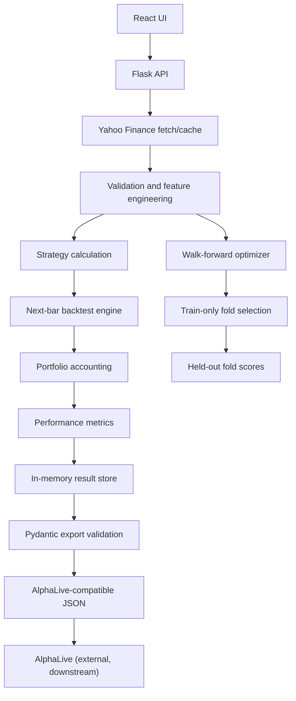
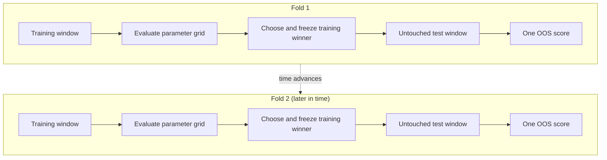

# AlphaLab

A full-stack strategy research platform for systematic trading: it backtests with next-bar
execution and explicit transaction costs, selects parameters via held-out walk-forward validation,
and returns schema-validated JSON compatible with a separate execution engine, **AlphaLive**.

## Status and evidence boundary

**Portfolio release / engineering prototype.** The backtest engine, cost modelling, and
walk-forward machinery are implemented and exercised by an automated test suite (532 backend
tests) and real-data research scripts run outside CI. This README makes no claim of discovered
trading alpha: the daily-strategy walk-forward script covers three of nine strategies with
uncommitted output, and the Greenblatt screener has a committed result for one of six regime
windows, where the ranking didn't beat diversification (see [Results](#results)). Both are evidence
about the validation machinery, not proof of trading performance.

## Engineering highlights

- **Causality-safe execution** - a signal generated at bar N's close only fills at bar N+1's open,
  enforced architecturally and verified at runtime.
- **Leakage-safe walk-forward optimization** - each fold picks parameters from training data only,
  then that frozen choice is scored once on the untouched test window.
- **Realistic costs** - percentage-of-notional slippage and commission (default `0.0`),
  position-size limits, and a max-drawdown halt evaluated on every bar's mark-to-market equity
  (not only after a fill), applied through the portfolio layer - see
  [Causality-safe backtesting and costs](#causality-safe-backtesting-and-costs) for what isn't
  simulated.
- **Schema-validated export** - Pydantic validates export structure and each strategy's parameter
  model; a conditional cross-repo test compares schema fields when AlphaLive is available, reducing
  but not eliminating contract-drift risk.
- **Real cross-repo compatibility evidence** - AlphaLive's pytest-collected multi-ticker
  signal-parity tests, including a documented xfail for one ATR-related case, not just this
  README's own assertion of parity.

## Research-to-export architecture

React (TypeScript, Vite) talks to a Flask REST API, which fetches and caches Yahoo Finance data,
then validates and feature-engineers it. From there, data either runs through a strategy and the
next-bar backtest engine into a stored in-memory result, or through the walk-forward optimizer,
producing held-out fold scores rather than a stored result. A stored backtest result can become
AlphaLive-compatible JSON via `/api/strategies/export`, which validates the export structure and
parameter model with Pydantic before returning it.


```mermaid
flowchart TB
    UI["React UI"] --> API["Flask API"]
    API --> FETCH["Yahoo Finance fetch/cache"]
    FETCH --> FEAT["Validation and feature engineering"]
    FEAT --> STRAT["Strategy calculation"]
    STRAT --> BT["Next-bar backtest engine"]
    BT --> PORT["Portfolio accounting"]
    PORT --> MET["Performance metrics"]
    MET --> STORE["In-memory result store"]
    FEAT --> OPT["Walk-forward optimizer"]
    OPT --> SEL["Train-only fold selection"]
    SEL --> SCORE["Held-out fold scores"]
    STORE --> EXP["Pydantic export validation"]
    EXP --> JSON["AlphaLive-compatible JSON"]
    JSON --> LIVE["AlphaLive (external, downstream)"]
```

AlphaLive is external and separately maintained: the endpoint only returns compatible JSON, and the
walk-forward branch is research, not an export input. Three repos make up the system: **AlphaLab**
(research and export), **AlphaLive** (loads a compatible export, generates signals, applies risk
controls, includes an Alpaca broker adapter and paper-trading configuration), and **AlphaSignal**
(a RAG/sentiment service AlphaLive consumes as an optional pre-execution gate).

## Causality-safe backtesting and costs

The backtest engine is event-driven: a strategy generates a signal at bar N's close, the engine
queues it as pending, and it fills at bar N+1's open - enforced architecturally and verified at
runtime, by regenerating signals after appending future bars and confirming the historical signal
stayed unchanged. That's one targeted test, not proof no leakage exists anywhere, but it's runtime
evidence, not just a design claim.

Costs are applied in the portfolio layer, and two commission settings shouldn't be confused. The
engine simulates `backend/config.yaml`'s `backtest.commission` - a percentage-of-notional rate per
fill, currently `0.0` - plus slippage and position-size limits, all in the portfolio layer.
`risk_settings.commission_per_trade` is different: a flat USD fee, accepted and exported but not
simulated by AlphaLab, since the portfolio has no flat-fee model. It, `max_daily_loss_pct`, and
`max_open_positions` flow through to the export but aren't simulated here either - AlphaLab is
single-ticker/single-position, with no multi-position cap or daily-loss tracking to enforce; they
take effect once running in AlphaLive. The `max_drawdown_pct` halt is checked on every bar's
mark-to-market equity update (the portfolio's single per-bar `record_value()` call, used by every
simulation loop), not only after a fill, so a price-only drawdown with no order on the breach bar
is still caught the bar it happens. `>=` the configured threshold counts as a breach, and the halt
is a first-breach latch, not a rolling check - price recovering afterward doesn't clear it.

## Leakage-safe walk-forward optimization

Grid search alone overfits: picking parameters that scored best on the test set and reporting that
score is circular. AlphaLab's optimizer instead evaluates the full grid on each fold's training
window, freezes whichever combination won on training data only, and scores that frozen choice
once against the fold's held-out test window. Test-fold performance never influences which
combination is chosen, and successive folds advance through time.


```mermaid
flowchart TB
    subgraph F1["Fold 1"]
        direction LR
        T1["Training window"] --> G1["Evaluate parameter grid"] --> W1["Choose and freeze training winner"] --> X1["Untouched test window"] --> S1["One OOS score"]
    end
    subgraph F2["Fold 2 (later in time)"]
        direction LR
        T2["Training window"] --> G2["Evaluate parameter grid"] --> W2["Choose and freeze training winner"] --> X2["Untouched test window"] --> S2["One OOS score"]
    end
    F1 -.time advances.-> F2
```

The final "best" parameter set an optimizer run returns - and the full-data backtest often quoted
alongside it - is chosen the same train-only way, but over the *entire* dataset. That figure is an
in-sample reference, not additional out-of-sample evidence on top of the fold scores.

## Results

The shipped strategies are established, textbook systematic approaches - moving-average crossovers,
RSI mean reversion, Bollinger breakouts - rather than novel alpha models.

`scripts/walk_forward_validation.py` exercises AlphaLab's walk-forward machinery on three strategies
(`rsi_simple`, `bollinger_rsi_combo`, `trend_adaptive_rsi`) across two rolling SPY windows (train
2019-2021 / test 2022, and train 2020-2022 / test 2023). It doesn't run in CI, its output isn't
committed, and it doesn't cover `ma_crossover`, `momentum_breakout`, or `bollinger_breakout`. The
repository demonstrates the methodology for those three strategies and two windows, not a committed
result across all nine. AlphaLab makes no claim that any shipped strategy has discovered persistent
market alpha.

The Greenblatt Magic Formula screener/weekly strategy has a narrower committed evidence base.
`scripts/greenblatt_research.py` supports six regime windows, but only one is committed:
[`scripts/greenblatt_research_result.json`](scripts/greenblatt_research_result.json), the 2022 Bear
window, where the ranked strategy scored Sharpe `-1.1581` against an equal-weight benchmark of the
same universe at `-0.3927` - it did not beat diversification in that window. The repository provides
no committed evidence for a broader six-window conclusion. The result also carries the caveat
already noted: `FundamentalScreener` applies today's fundamentals to historical prices, over a
hand-picked, present-day universe, so point-in-time and survivorship limitations remain.

## AlphaLive export contract and parity evidence

Not every backtestable strategy is deployable. `POST /api/strategies/export` rejects `rsi_simple`
(research-only) and `vwap_reversion` (needs an intraday timeframe AlphaLab can't fetch) with a 422
and explanation, rather than a config AlphaLive would only reject later. Both remain backtestable;
neither is exportable, leaving **seven of the nine** strategies directly exportable.

Contract and cross-engine evidence exist at four levels, which shouldn't be conflated:

- **Export-time validation.** Pydantic validates the export structure and each strategy's
  parameter model before returning JSON.
- **Local contract fixture (always runs).** `backend/tests/test_local_export_contract.py` validates
  every exportable strategy's real, final export JSON against a small, versioned, AlphaLab-only
  snapshot (`backend/tests/fixtures/export_contract_v1.0.json`) - field names, nested block shapes,
  alias translations, and rejection of `rsi_simple`/`vwap_reversion`. It needs no AlphaLive checkout
  and can't silently skip, but it only catches AlphaLab's own export drift, not whether a future
  AlphaLive version would still accept it, and it doesn't prove signal parity.
- **Conditional schema-field parity.** `backend/tests/test_schema_contract.py` compares AlphaLab's
  and AlphaLive's Pydantic field sets when AlphaLive is checked out as a sibling directory. CI
  attempts that checkout with `continue-on-error: true`, skipping the module (not failing the
  build) if it's unavailable - so this doesn't run on every CI build.
- **Cross-engine signal diagnostics (AlphaLive repo).**
  [`test_signal_parity.py`](https://github.com/bernardoguterres/AlphaLive/blob/main/tests/test_signal_parity.py)
  is a standalone diagnostic script, not pytest/CI-collected.
  [`test_multi_ticker_parity.py`](https://github.com/bernardoguterres/AlphaLive/blob/main/tests/test_multi_ticker_parity.py)
  is pytest-collected with strict assertions and a documented `xfail` for an RSI/MSFT case tied to
  the two repos' independently implemented ATR calculations.
  [`test_schema_contract.py`](https://github.com/bernardoguterres/AlphaLive/blob/main/tests/test_schema_contract.py)
  mirrors the check above from AlphaLive's own suite.

These checks provide useful compatibility evidence, not a measured repository-wide parity
percentage; the RSI, ATR and parameter-alias cases they exercise are covered by the linked tests,
but no single aggregate parity claim is supported.

## Interface and supported strategies

The React UI covers backtest configuration/results (single, batch, parameter-optimize), strategy
comparison, cached-data management, and settings - a Flask API client only.

Nine strategies are implemented and backtestable, spanning trend-following, mean-reversion,
breakout, and value-factor approaches. Defaults are AlphaLab's own; AlphaLive may apply its own
defaults for fields an export omits.

| # | Strategy | Type | Key params | Deployable |
|---|---|---|---|---|
| 1 | `ma_crossover` | Trend-following | `short_window` (50), `long_window` (200), `volume_confirmation`, `cooldown_days` | Yes |
| 2 | `rsi_mean_reversion` | Mean reversion, stateful (stop-loss, cooldown, BB/ADX confirmation) | `rsi_period` (14), `oversold` (30), `overbought` (70) | Yes |
| 3 | `momentum_breakout` | Breakout | `lookback` (20), `volume_surge_pct` (150), `rsi_min` (50) | Yes |
| 4 | `bollinger_breakout` | Volatility breakout | `bb_period` (20), `bb_std_dev` (2.0), `confirmation_bars` (2) | Yes |
| 5 | `vwap_reversion` | VWAP mean reversion | `vwap_period` (20), `deviation_threshold` (2.0) | No - needs an intraday timeframe AlphaLab can't fetch |
| 6 | `bollinger_rsi_combo` | Dual-confirmation mean reversion | `bb_period` (20), `rsi_oversold` (45), `rsi_overbought` (55) | Yes |
| 7 | `trend_adaptive_rsi` | Regime-adaptive RSI | `trend_sma` (50), separate up/down/range thresholds | Yes |
| 8 | `greenblatt_weekly` | Value factor, weekly bars | `fast_sma` (10w), `slow_sma` (50w), `min_hold_bars` (52w), `trailing_stop_pct` (0.20, a fraction of 20%) | Yes - see [Results](#results) for the point-in-time caveat |
| 9 | `rsi_simple` | Simple RSI mean reversion, no state machine | `period` (14), `oversold` (40), `overbought` (60) | No - research-only |

`greenblatt_weekly`'s `trailing_stop_pct` is AlphaLab's internal name; export translates it to the
contract's `trailing_stop_fraction`. `FundamentalScreener` (`POST /api/screener/greenblatt`) ranks
a universe by the true Greenblatt formula (earnings yield + return on capital) ahead of
`greenblatt_weekly`; see the caveats above before treating its output as validated.

**Selected API endpoints:** `/api/health`, `/api/data/fetch`, `/api/data/available`,
`/api/strategies/backtest`, `/api/strategies/optimize`, `/api/strategies/export`,
`/api/metrics/<id>`, `/api/compare`, `/api/screener/greenblatt` - schemas in
`backend/alphalab/api/blueprints/` and `docs/STRATEGY_SCHEMA.md`.

## Quick Start

**Prerequisites:** Python 3.10+, Node.js 18+, npm. (Uses `dict | None` syntax, unsupported before
3.10 without `from __future__ import annotations`.)

```bash
# Backend
cd backend
python3 -m venv venv && source venv/bin/activate
pip install -r requirements.txt
python run.py                          # http://127.0.0.1:5050

# Frontend (separate terminal)
cd frontend
npm install
npm run dev                            # http://localhost:8080
```

Run a backtest:

```bash
curl -X POST http://127.0.0.1:5050/api/strategies/backtest \
  -H "Content-Type: application/json" \
  -d '{
    "ticker": "AAPL", "strategy": "rsi_mean_reversion",
    "start_date": "2020-01-01", "end_date": "2024-12-31",
    "params": {"rsi_period": 14, "oversold": 30, "overbought": 70}
  }'
```

Run walk-forward validation with the same shape against `/api/strategies/optimize`, adding
`"param_grid": {...}, "walk_forward": true, "n_folds": 3` - see
[Leakage-safe walk-forward optimization](#leakage-safe-walk-forward-optimization).

Export a deployable strategy (note the `backtest_id` from a prior backtest call):

```bash
curl -X POST http://127.0.0.1:5050/api/strategies/export \
  -H "Content-Type: application/json" \
  -d '{"backtest_id": "<backtest_id from above>"}'
```

`rsi_simple` and `vwap_reversion` return a 422 with an explanation instead of an export - see
[AlphaLive export contract and parity evidence](#alphalive-export-contract-and-parity-evidence).

## Verification

Run from the repository root, using subshells so each command's `cd` doesn't leak into the next:

```bash
(cd backend && source venv/bin/activate && pytest tests/ -v)   # 532 tests
(cd frontend && npm run test)                                   # 42 tests (Vitest)
(cd frontend && npm run lint)                                    # ESLint (convention, not CI-enforced)
```

Test count is a coverage indicator, not the headline result - the walk-forward methodology and
export-contract evidence above are. CI (`.github/workflows/ci.yml`) runs `black --check` and
`pytest`, plus a conditional AlphaLive checkout for the schema-contract test (see
[export contract and parity evidence](#alphalive-export-contract-and-parity-evidence)); no backend
lint step or frontend CI lint gate exists today.

## Deployment configuration

Both `backend/` and `frontend/` have a `Dockerfile` intended for Railway (backend via gunicorn
through `wsgi.py`, frontend as a static Vite build served by nginx, with `nginx.conf.template`
handling the SPA fallback and Railway's dynamic `$PORT`). `config.py` reads `PORT`, `HOST`, `DEBUG`,
and `ALLOWED_ORIGINS` env vars to override `backend/config.yaml`. These files are present and
internally consistent by static inspection, with no committed container smoke-test evidence and no
externally reachable deployment - deployment configuration, not a runtime-verified service.

## Known limitations

- **No point-in-time fundamentals** - `FundamentalScreener` uses today's financials against
  historical prices, over a hand-picked present-day universe.
- **Cross-engine parity is diagnostic, not a measured percentage** - see
  [export contract and parity evidence](#alphalive-export-contract-and-parity-evidence).
- **`max_daily_loss_pct`, `max_open_positions`, and `commission_per_trade` aren't simulated here** -
  accepted and exported, taking effect only once running in AlphaLive.
- **Only one of six Greenblatt regime windows has a committed result.**
- **Only three daily strategies have a walk-forward script (two SPY windows), and its output isn't
  committed**; `ma_crossover`, `momentum_breakout`, `bollinger_breakout` have none. No strategy here
  should be treated as ready for live capital.
- **No live deployment has run.**

## Documentation, license and disclaimer

- [`docs/STRATEGY_SCHEMA.md`](docs/STRATEGY_SCHEMA.md) - export-contract schema, including a
  per-strategy field reference and a locally-run contract-fixture safeguard
  (`backend/tests/test_local_export_contract.py`) that doesn't depend on AlphaLive being checked
  out. The export route remains authoritative for which strategies are deployable - see
  [AlphaLive export contract and parity evidence](#alphalive-export-contract-and-parity-evidence).
- `docs/MATH_EXPLAINER.md` covers the same math as this README with more derivation detail; its
  Greenblatt section is scoped to the one committed 2022 Bear window (see [Results](#results)),
  not a broader multi-window claim.

**Risk disclaimer:** these strategies are experimental research examples, not investment advice.
Historical backtest results are not a forecast, and no strategy here is ready for live capital. If
evaluated further, strategies should first be exercised in a controlled paper environment. AlphaLive
provides the execution path and paper-trading configuration, but its Alpaca paper-account runtime
and long-duration unattended operation have not been validated.

**License:** all rights reserved, proprietary work - no license is granted for use, copying, or
redistribution. Not accepting external contributions; `backend/tests/` and
`frontend/src/**/*.test.ts(x)` are the best starting point for evaluation.
